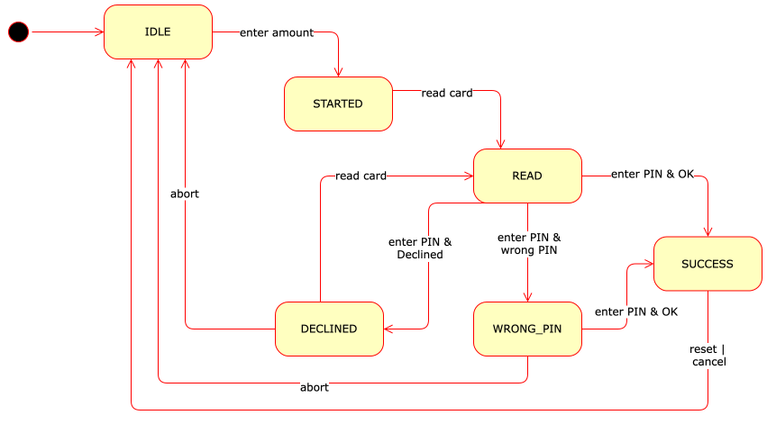

# Point of Sale

Write a basic software to orchestrate a *Point of Sale* (POS) device that is able to read a credit card and perform a payment transaction interacting with a credit card issuer service.

All problems are notified through exception `PosException`.

## R1 - Configuration

The main class `PosApp` is intended to be called by a user interface.

In configuration phase, it is possible to register the information about the merchant 
that operates the POS through the method `setMerchantInfo()` that accepts three text lines
that must be shorter than 20 characters and not `null`, an exception is thrown if not compliant.

Method `getMerchantInfo()` returns a string composed by the three lines separated by `\n`.

Depending on the credit card issuer different servers shoud be used.
The method `registerIssuer()` registers a new issuer (e.g. `"Visa"`) by providing a name of the card issuer, an
object, implementing the interface `Issuer`, that is used to complete the payment,
and a list of Issuer Identification Number (IIN). According to standard ISO/IEC 7812,
IIN is the list of initial digits of a card number that allow to identify the issuer 
(e.g. Visa has IIN `"4"`, Mastercard `"51","52","53","54","55"`).

It is possible to retrieve the name of the issuer given a credit card number
using the method `getIssuer()`.

The current date can be retrived using the method `currentDate()` that is initialized to the computer current date.
It is possible to define a different date (e.g. for testing purposes) using the method
`setCurrentDate()`.

**NOTE:** you must not implement the interface `Issuer`, the
tests will provide a mock implementation used for testing purposes.

## R2 - Simple transaction

The POS works by moving through a few states illustrated in the diagram below.

The POS is initialized in state `IDLE` from which a new transaction can be started using the method `beginPayment()` that accepts the amount to be payed and goes into state `STARTED`.

At this stage, the user can swipe the card through the read that causes the method `readStripe()` to be called; the method receives the credit card number (16 digits), the name of  the card holder and the expiration date (4 digits with format MMYY, e.g. 0924 means September 2024).
The method, if successful, transitions into state `READ` otherwise it becomes `DECLINED`.

Then the user must enter the PIN in order to proceed with the payment.
Method `performPayment()` accepts the PIN and performs the payment.
The payment is performed by calling server associated with the card issuer through the method `performPayment()`.

The transaction result returned by the server determines what is done next:

- if result code is `OK` the state becomes `SUCCESS` and the method returns the transaction ID
- if result code is `WRONG_PIN` the state becomes `WRONG_PIN` and the method throws an exception
- if result code is `DECLINED`, `TIMEOUT`, or `ERROR`, the state becomes `DECLINED` and the method throws an exception

From status `WRONG_PIN` a new PIN can be entered.
From status `DECLINED` a new card can be swiped.

## R3 - Complete transaction

After a successful transaction it is possible to return to the initial `IDLE` state using the method `reset()`.

After a successful transaction, it is possible to cancel the transaction using the method `cancelTransaction()` that should call the mehtod `cancelPurchase()` of the issuer server passing the transaction ID. The method throws and exception if the current state is not `SUCCESS` or if the cancelation result is not `OK`.

During a transaction (except after a successful payment) it is possible to abort the transaction and return to the `IDLE` state using the method `abortPayment()`.

## R4 - Stats

Method `receipt()` returns a string containing the text of the receipt with the following information:

* the merchant info
* the date of the payment
* the last 4 digits of the credit card number
* the amount of the payment
* the result of the payment (`OK` or `ERROR`)
* the transaction ID

The information must be on separate lines.

The mehtod `transactionsByIssuer()` returns a map having the issuers as keys and the lists of completed transaction IDs as values.

The method `totalByIssuer()` returns a map having the issuers as keys and the relative total amount of successful transactions as values.

## R5 - Checks

The `readStripe()` methods must check that the expiration date of the credit card is not passed, in case the credit card is expired the method throws an exception and goes into state `DECLINED`.

- *Hint:* use the methods `getYear()` and `getMonthValue()` of class `LocalDate`.

The last digit of the credit card number is a parity number that is computed using the Luhn Algorithm:

1. the payload consists of the initial 15 digits (i.e. the credit card number without the last parity digit)
2. with the payload, start from the rightmost digit. Moving left, double the value of every second digit (including the rightmost digit)
3. sum the values of the resulting digits (e.g. 14 is 1 + 4 = 5)
4. the check digit is calculated as *( 10 − ( s mod 10 ) )*, where *s* is the sum from the previous step

Example (with 4 digits credit card number)

| Number   | 6      |  5  |  4    |  8     |
|----------|--------|-----|-------|--------|
| Step 1   | pl     | pl  | pl    | parity |
| Step 2   | 6*2=12 | 5   | 4*2=8 | -      |
| Step 3   | 3 =1+2 | 5   | 4     | -      |
| Step 4   | - | -  | -  | 8=10-(12%10) |

The `readStripe()` method must check that the computed parity digit matches the one in the credit card number, if it does not then the method throws an exception and goes into state `DECLINED`.
